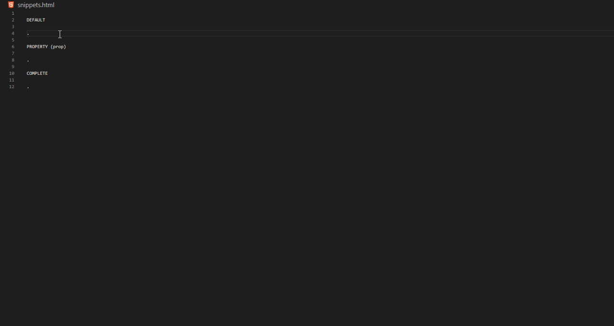

# Nativescript: Angular HTML Snippets (vscode extension)

**Updated for Nativescript v6.4.0 and Angular v9.0.0 release**

This extension adds all Nativescript UI Components, Layouts and Gestures snippets in your HTML.

## Features

* Default syntax (Plain Nativescript tag)
* Property syntax (Includes all element properties)
* Complete syntax (Includes all element properties, events and documentation)
* Layout snippets
* Gesture snippets
* System Icon snippets

For more examples and demo, [see here][snippet-reference].

## Syntax

| Suffix              | Description    | Output                                  |
| ------------------- | -------------- | --------------------------------------- |
| `-prop`             | property       | + all element properties                |
| `-comp`             | complete       | + all element properties and events     |
| `-snippet-[number]` | layout snippet | Layout snippets available in site docs  |

## Usage

|                 | snippet    | entered by user | output                      | description                           |
| --------------- | ---------------- | --------- | --------------------------- | ------------------------------------- |
| default         | `ns-button`      | `nsbutt`  | `<Button></Button>`         | Plain tag                             |
| property (prop) | `ns-button-prop` | `nsbutpr` | with *props                 | + All properties                      |
| complete (comp) | `ns-button-comp` | `nsbu-c`  | with *props, *events, *docs | + All properties, events and API docs |
| layout snippets | `ns-dock-layout-snippet-2`   | `nsdocnip2`  | see below    | Sample snippets from [site docs].     |
| gestures        | `ns-tap`         | `nstap`   | `(tap)=""`                  | Gesture Snippets                      |
| setting icon    | `ns-icon-stop`   | `nsicost` | `14`                        | [Setting Icon] snippets               |

### In Action: `ns-dock-layout-snippet-2`

``` html
<DockLayout width="210" height="210" backgroundColor="lightgray" stretchLastChild="true">
  <Label text="left" dock="left" backgroundColor="red"></Label>
  <Label text="top" dock="top" backgroundColor="green"></Label>
  <Label text="right" dock="right" backgroundColor="blue"></Label>
  <Label text="bottom" dock="bottom" backgroundColor="yellow"></Label>
</DockLayout>
```

### In Action: `ns-button`

#### Default output

``` html
<Button></Button>
```

#### Property output

``` html
<Button text=""></Button>
```

#### Complete output

``` html
<Button
  text="string"
  (tap)=""
  (loaded)=""
  (unloaded)=""
  (layoutChanged)="">
</Button>
<!--
Properties
NAME	TYPE	  DESCRIPTION
text	string	Gets or sets the label of the button.

Events
NAME	        DESCRIPTION
tap	          Emitted when the button is tapped.
loaded	      Emitted when the view is loaded.
unloaded	    Emitted when the view is unloaded.
layoutChanged	Emitted when the layout bounds of a view changes due to layout processing.
 -->
```

## Demo

**HTML snippet `ns-text-field` in action; _default_, _property_ (prop) and _complete_ (comp) syntax demo.**



## Snippets

For complete references examples and demo, [see here][snippet-reference].

### User Interface > Layouts

* ns-absolute-layout
* ns-dock-layout
* ns-grid-layout
* ns-stack-layout
* ns-wrap-layout
* ns-flexbox-layout

### User Interface > Components

* ns-actionbar
* ns-actionbarextension
* ns-actionitem
* ns-navigationbutton
* ns-activityindicator
* ns-button
* ns-datepicker
* ns-formattedstring
* ns-htmlview
* ns-image
* ns-label
* ns-listpicker
* ns-listview
* ns-progress
* ns-scroll-view
* ns-search-bar
* ns-segmented-bar
* ns-segmented-bar-item
* ns-slider
* ns-switch
* ns-bottom-navigation
* ns-tab-strip
* ns-tab-strip-item
* ns-tab-content-item
* ns-tabs
* ns-tab-view
* ns-tab-view-item
* ns-text-field
* ns-text-view
* ns-time-picker
* ns-web-view

### Gestures

| Snippet        | Output           |
|----------------|------------------|
| `ns-tap`       | `(tap)=""`       |
| `ns-doubleTap` | `(doubleTap)=""` |
| `ns-longPress` | `(longPress)=""` |
| `ns-swipe`     | `(swipe)=""`     |
| `ns-pan`       | `(pan)=""`       |
| `ns-pinch`     | `(pinch)=""`     |
| `ns-rotation`  | `(rotation)=""`  |
| `ns-touch`     | `(touch)=""`     |

### Setting Icons

| Snippet          | Output |
|------------------|--------|
|`ns-icon-action`  | `9`    |
|`ns-icon-undo`    | `21`   |

#### List

|	ICON	        | VALUE |	ICON        | VALUE |
|---------------|-------|-------------|-------|
| Done		      | 0	    |	Search      | 12    |
| Cancel	      | 1	    |	Refresh     | 13    |
| Edit		      | 2	    |	Stop        | 14    |
| Save		      | 3	    |	Camera      | 15    |
| Add		        | 4	    |	Trash       | 16    |
| FlexibleSpace | 5	    |	Play        | 17    |
| FixedSpace	  | 6	    |	Pause       | 18    |
| Compose		    | 7	    |	Rewind      | 19    |
| Reply		      | 8	    |	FastForward | 20    |
| Action		    | 9	    |	Undo        | 21    |
| Organize		  | 10    |	Redo        | 22    |
| Bookmarks		  | 11    |	PageCurl    | 23    |

Reference: https://docs.nativescript.org/angular/ui/action-bar#setting-icons

## Installation

  1. Install Visual Studio Code v1.30.0 or higher
  1. Launch Code
  1. From the command palette `Ctrl+Shift+P` (Windows, Linux) or `Cmd+Shift+P` (OSX)
  1. Select Install Extensions
  1. Choose **Nativescript: Angular HTML Snippets** by _ElecTreeFrying_
  1. Reload Visual Studio Code

## Changelog

See [CHANGELOG] for more information.

## Contributing

* File bugs, feature requests in [GitHub Issues].
* Leave a review on [Visual Studio Marketplace].

## Related

[More extensions of mine]

## License

MIT

[Link]: https://github.com/ElecTreeFrying/nativescript-angular-html-snippets/blob/master/reference.md
[snippet-reference]: https://github.com/ElecTreeFrying/nativescript-angular-html-snippets/blob/master/reference.md
[documentation]: https://docs.nativescript.org/angular/start/introduction
[Setting Icon]: https://docs.nativescript.org/angular/ui/action-bar#setting-icons
[snippet 2]: https://docs.nativescript.org/angular/ui/layouts/layout-containers#docklayout
[site docs]: https://docs.nativescript.org/angular/ui/layouts/layout-containers#docklayout

[CHANGELOG]: https://marketplace.visualstudio.com/items/ElecTreeFrying.nativescript-angular-html-snippets/changelog
[Github Issues]: https://github.com/ElecTreeFrying/nativescript-angular-html-snippets/issues
[Visual Studio Marketplace]: https://marketplace.visualstudio.com/items?itemName=ElecTreeFrying.nativescript-angular-html-snippets&ssr=false#review-details
[More extensions of mine]: https://marketplace.visualstudio.com/publishers/ElecTreeFrying
