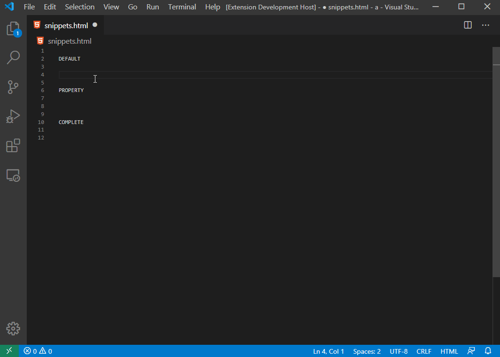
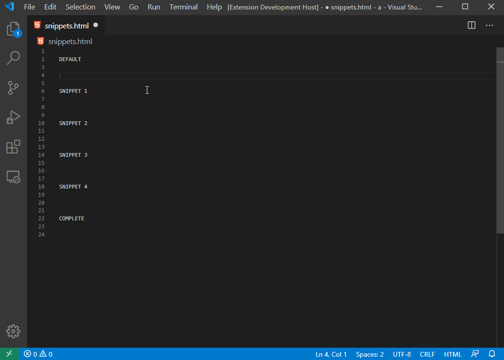

# Snipppet Reference

## Contents

1. **Syntax**
1. **Usage**
1. **Snippets**
1. **Examples**
1. **Demo**


## Syntax

| Suffix              | Description    | Output                                  |
| ------------------- | -------------- | --------------------------------------- |
| `-prop`             | property       | + all element properties                |
| `-comp`             | complete       | + all element properties and events     |
| `-snippet-[number]` | layout snippet | Layout snippets available in site docs  |

## Usage

|                 | snippet    | entered by user | output                      | description                           |
| --------------- | ---------------- | --------- | --------------------------- | ------------------------------------- |
| default         | `ns-button`      | `nsbutt`  | `<Button></Button>`         | Plain tag                             |
| property (prop) | `ns-button-prop` | `nsbutpr` | with *props                 | + All properties                      |
| complete (comp) | `ns-button-comp` | `nsbu-c`  | with *props, *events, *docs | + All properties, events and API docs |
| layout snippets | `ns-dock-layout-snippet-2`   | `nsdocnip2`  | see below    | Sample snippets from [site docs].     |
| gestures        | `ns-tap`         | `nstap`   | `(tap)=""`                  | Gesture Snippets                      |
| setting icon    | `ns-icon-stop`   | `nsicost` | `14`                        | [Setting Icon] snippets               |

### Snippet: `ns-dock-layout-snippet-2`

``` html
<DockLayout width="210" height="210" backgroundColor="lightgray" stretchLastChild="true">
  <Label text="left" dock="left" backgroundColor="red"></Label>
  <Label text="top" dock="top" backgroundColor="green"></Label>
  <Label text="right" dock="right" backgroundColor="blue"></Label>
  <Label text="bottom" dock="bottom" backgroundColor="yellow"></Label>
</DockLayout>
```

### In Action: `ns-button`

#### Default output

``` html
<Button></Button>
```

#### Property output

``` html
<Button text=""></Button>
```

#### Complete output

``` html
<Button
  text="string"
  (tap)=""
  (loaded)=""
  (unloaded)=""
  (layoutChanged)="">
</Button>
<!--
Properties
NAME	TYPE	  DESCRIPTION
text	string	Gets or sets the label of the button.

Events
NAME	        DESCRIPTION
tap	          Emitted when the button is tapped.
loaded	      Emitted when the view is loaded.
unloaded	    Emitted when the view is unloaded.
layoutChanged	Emitted when the layout bounds of a view changes due to layout processing.
 -->
```

### In Action: `ns-dock-layout-snippet-2`

#### Snippet

``` html
<DockLayout width="210" height="210" backgroundColor="lightgray" stretchLastChild="true">
  <Label text="left" dock="left" backgroundColor="red"></Label>
  <Label text="top" dock="top" backgroundColor="green"></Label>
  <Label text="right" dock="right" backgroundColor="blue"></Label>
  <Label text="bottom" dock="bottom" backgroundColor="yellow"></Label>
</DockLayout>
```

## Snippets

### Layouts

* `ns-absolute-layout`
* `ns-absolute-layout-snippet-1`
* `ns-absolute-layout-snippet-2`
* `ns-absolute-layout-comp`
* `ns-dock-layout`
* `ns-dock-layout-snippet-1`
* `ns-dock-layout-snippet-2`
* `ns-dock-layout-snippet-3`
* `ns-dock-layout-snippet-4`
* `ns-dock-layout-comp`
* `ns-grid-layout`
* `ns-grid-layout-snippet-1`
* `ns-grid-layout-snippet-2`
* `ns-grid-layout-snippet-3`
* `ns-grid-layout-snippet-4`
* `ns-grid-layout-snippet-5`
* `ns-grid-layout-snippet-6`
* `ns-grid-layout-comp`
* `ns-stack-layout`
* `ns-stack-layout-snippet-1`
* `ns-stack-layout-snippet-2`
* `ns-stack-layout-snippet-3`
* `ns-stack-layout-snippet-4`
* `ns-stack-layout-comp`
* `ns-wrap-layout`
* `ns-wrap-layout-snippet-1`
* `ns-wrap-layout-snippet-2`
* `ns-wrap-layout-snippet-3`
* `ns-wrap-layout-snippet-4`
* `ns-wrap-layout-comp`
* `ns-flexbox-layout`
* `ns-flexbox-layout-snippet-1`
* `ns-flexbox-layout-snippet-2`
* `ns-flexbox-layout-snippet-3`
* `ns-flexbox-layout-snippet-4`
* `ns-flexbox-layout-snippet-5`
* `ns-flexbox-layout-snippet-6`
* `ns-flexbox-layout-comp`

### Components

* `ns-actionbar`
* `ns-actionbar-comp`
* `ns-actionbarextension`
* `ns-actionitem`
* `ns-actionitem-prop`
* `ns-actionitem-comp`
* `ns-navigationbutton`
* `ns-navigationbutton-prop`
* `ns-navigationbutton-comp`
* `ns-activityindicator`
* `ns-activityindicator-prop`
* `ns-activityindicator-comp`
* `ns-button`
* `ns-button-prop`
* `ns-button-comp`
* `ns-datepicker`
* `ns-datepicker-prop`
* `ns-datepicker-comp`
* `ns-formattedstring`
* `ns-formattedstring-comp`
* `ns-htmlview`
* `ns-htmlview-comp`
* `ns-image`
* `ns-image-comp`
* `ns-label`
* `ns-label-prop`
* `ns-label-comp`
* `ns-listpicker`
* `ns-listpicker-prop`
* `ns-listpicker-comp`
* `ns-listview`
* `ns-listview-prop`
* `ns-listview-comp`
* `ns-progress`
* `ns-progress-comp`
* `ns-scroll-view`
* `ns-scroll-view-prop`
* `ns-scroll-view-comp`
* `ns-search-bar`
* `ns-search-bar-prop`
* `ns-search-bar-comp`
* `ns-segmented-bar`
* `ns-segmented-bar-prop`
* `ns-segmented-bar-comp`
* `ns-segmented-bar-item`
* `ns-slider`
* `ns-slider-comp`
* `ns-switch`
* `ns-switch-prop`
* `ns-switch-comp`
* `ns-bottom-navigation`
* `ns-bottom-navigation-prop`
* `ns-bottom-navigation-comp`
* `ns-tab-strip`
* `ns-tab-strip-prop`
* `ns-tab-strip-comp`
* `ns-tab-strip-item`
* `ns-tab-strip-item-prop`
* `ns-tab-strip-item-comp`
* `ns-tab-content-item`
* `ns-tabs`
* `ns-tabs-prop`
* `ns-tabs-comp`
* `ns-tab-view`
* `ns-tab-view-prop`
* `ns-tab-view-comp`
* `ns-tab-view-item`
* `ns-tab-view-item-comp`
* `ns-text-field`
* `ns-text-field-prop`
* `ns-text-field-comp`
* `ns-text-view`
* `ns-text-view-prop`
* `ns-text-view-comp`
* `ns-time-picker`
* `ns-time-picker-prop`
* `ns-time-picker-comp`
* `ns-web-view`
* `ns-web-view-prop`
* `ns-web-view-comp`

### Gestures

* `ns-tap` → `(tap)=""`
* `ns-doubleTap` → `(doubleTap)=""`
* `ns-longPress` → `(longPress)=""`
* `ns-swipe` → `(swipe)=""`
* `ns-pan` → `(pan)=""`
* `ns-pinch` → `(pinch)=""`
* `ns-rotation` → `(rotation)=""`
* `ns-touch` → `(touch)=""`

### System Icons

* `ns-icon-done` → `0`
* `ns-icon-cancel` → `1`
* `ns-icon-edit` → `2`
* `ns-icon-save` → `3`
* `ns-icon-add` → `4`
* `ns-icon-flexibleSpace` → `5`
* `ns-icon-fixedSpace` → `6`
* `ns-icon-compose` → `7`
* `ns-icon-reply` → `8`
* `ns-icon-action` → `9`
* `ns-icon-organize` → `10`
* `ns-icon-bookmarks` → `11`
* `ns-icon-search` → `12`
* `ns-icon-refresh` → `13`
* `ns-icon-stop` → `14`
* `ns-icon-camera` → `15`
* `ns-icon-trash` → `16`
* `ns-icon-play` → `17`
* `ns-icon-pause` → `18`
* `ns-icon-rewind` → `19`
* `ns-icon-fastForward` → `20`
* `ns-icon-undo` → `21`
* `ns-icon-redo` → `22`
* `ns-icon-pageCurl` → `23`

Reference: https://docs.nativescript.org/angular/ui/action-bar#setting-icons

## Examples

### In action: Components

Snippet: `ns-datepicker`

``` html
<BottomNavigation></BottomNavigation>
```

Snippet: `ns-datepicker-prop`

``` html
<BottomNavigation
  items="Array<TabContentItem>"
  selectedIndex="number"
  tabStrip="TabStrip">
</BottomNavigation>
```

Snippet: `ns-datepicker-comp`

``` html
<BottomNavigation
  items="Array<TabContentItem>"
  selectedIndex="number"
  tabStrip="TabStrip"
  (selectedIndexChanged)=""
  (loaded)=""
  (unloaded)=""
  (layoutChanged)="">
</BottomNavigation>
<!--
Properties
NAME	        TYPE	                DESCRIPTION
items	        Array<TabContentItem>	Gets or sets the items of the BottomNavigation.
selectedIndex	number	              Gets or sets the selectedIndex of the BottomNavigation.
tabStrip	    TabStrip	            Gets or sets the tab strip of the BottomNavigation.

Events
NAME	DESCRIPTION
selectedIndexChanged	Emitted when the selectedIndex property is changed.
loaded	              Emitted when the view is loaded.
unloaded	            Emitted when the view is unloaded.
layoutChanged	        Emitted when the layout bounds of a view changes due to layout processing.
-->
```

### In action: Layouts

Snippet: `ns-absolute-layout`

``` html
<AbsoluteLayout>
  
</AbsoluteLayout>
```

Snippet: `ns-absolute-layout-1`

``` html
<AbsoluteLayout width="210" height="210" backgroundColor="lightgray">
  <Label text="10, 10" left="10" top="10" width="90" height="90" backgroundColor="red"></Label>
  <Label text="110, 10" left="110" top="10" width="90" height="90" backgroundColor="green"></Label>
  <Label text="110, 110" left="110" top="110" width="90" height="90" backgroundColor="blue"></Label>
  <Label text="10, 110" left="10" top="110" width="90" height="90" backgroundColor="yellow"></Label>
</AbsoluteLayout>
```

Snippet: `ns-absolute-layout-2`

``` html
<AbsoluteLayout width="210" height="210" backgroundColor="lightgray">
  <Label text="no margin" left="10" top="10" width="100" height="100" backgroundColor="red"></Label>
  <Label text="margin=`30`" left="10" top="10" margin="30" width="100" height="90" backgroundColor="green"></Label>
</AbsoluteLayout>
```

Snippet: `ns-absolute-layout-comp`

``` html
<AbsoluteLayout>
  
</AbsoluteLayout>
<!--
AbsoluteLayout Properties
None.

AbsoluteLayout Child Properties
PROPERTY	DESCRIPTION
left	    Gets or sets the distance, in pixels, between the left edge of the child and the left edge of its parent AbsoluteLayout client area.
top	      Gets or sets the distance, in pixels, between the top edge of the child and the top edge of its parent AbsoluteLayout client area.
-->
```

## Demo

### `ns-searchbar` demo



### `ns-stack-layout` demo

